# Q8B 实机只读测试报告

日期：2026-09-07。测试对象：Radxa Dragon Q8B。范围：原生构建、CLI、TUI、Web/API 和硬件识别；不执行系统或硬件配置写入。

## 当前结论

首轮发现的 4 项识别/防护缺陷已修复，并于同日完成 Q8B 只读复测。Q8B 正确识别为 **UEFI + DT**，不等同于 ACPI，也不会再使用遗留 U-Boot 文件决定 Overlay 状态。详细结果见文末“修复后复测”。

同日已继续迁入 Q6A/Q8B 共用的原生 EFI/BLS Overlay 后端，并完成只读实机验证。读取、预览、冲突检查与临时 DTB 合并通过；写入/回滚在隔离夹具中验证。**真实启动项写入、重启生效、完整 Polkit 授权及外设电气行为仍未验收**。下方旧轮次结论保留为历史记录，最新结果见文末。

## 首轮结论（修复前）

程序可以在 Q8B 原生运行，但当前版本不能视为 Q8B 硬件管理验收通过。确认 4 项适配问题：High 1 项、Medium 3 项。应先修正 EFI Overlay 判断，再开展配置切换和重启验证。

| 编号 | 问题 | 严重程度 | 分类 |
| --- | --- | --- | --- |
| 1 | EFI 启动被识别为可管理的 U-Boot Overlay | High | Functional |
| 2 | 高通编解码节点被列入摄像头测试 | Medium | Functional |
| 3 | SoC 名称误用 SBC compatible | Medium | Functional |
| 4 | 同一根分区重复统计且误标为可移除 | Medium | Functional |

## 测试基线

- 工作区基于提交 `20460a6de1829b7d895e1b66e4df6ff8d751b556`，包含尚未提交的 Q8B Pinout、串口识别、许可及 UI 修改，不是该提交的纯净构建。
- 源码归档 SHA-256：`42eed5b605c5f2cfd368f91c78dabb4c20e373a523dc1d953030c6fc41248f58`。
- 实机：Ubuntu 26.04.1 LTS，aarch64，运行内核 `7.0.11-5-qcom`，约 15 GiB 内存。
- Device Tree model：`Radxa Dragon Q8B`；compatible：`radxa,dragon-q8b`、`qcom,sc8280xp`。
- `/sys/firmware/efi` 存在；EFI 分区挂载在 `/boot/efi`。EFI loader entries 包含 `7.0.11-5-qcom` 和 `7.0.11-6-qcom`，后者已安装但本轮没有重启切换。
- 5 号内核 entry 未指定 devicetree/overlay；6 号 entry 指定 Q8B DTB，`devicetree-overlay` 为空。不能用 `/boot/dtbo` 文件后缀推断当前 EFI/固件选择。
- Rust 1.85.0；Cargo 依赖离线 vendor；构建工具、源码、libc 开发文件都隔离在实机 `/tmp/rsetup-next-q8b-test.MhLJnm`，未安装系统软件包或修改用户 PATH。
- 为绕过目标机缺少 libc 开发文件的问题，将同版本 Ubuntu 官方 libc `.deb` 解包到临时 sysroot；构建 ARM64 静态 release 程序。`readelf -d` 确认没有动态段。
- 主程序 SHA-256：`3dab73deb0d6a18ef92ffcc28a40c835f4840305436dd84448ef4ec0fc9d93cd`。
- helper SHA-256：`0be48e77f71a057aca664ec84a9bf14df0dd05bc09bcf94d7774a7980975c4bf`。

## 已完成验证

| 层级 | 结果 | 边界 |
| --- | --- | --- |
| 原生 Rust 单元测试 | 74 项通过：core 63、app 10、helper 1 | 不等于硬件电气验证 |
| 发布构建 | 主程序、helper ARM64 静态构建成功 | 临时测试构建，不是 Debian 安装包验收 |
| CLI | 11 个只读命令退出码均为 0，JSON 可解析 | status、doctor、actions、sources，以及 7 个硬件状态命令 |
| TUI | 中文实时界面正常启动，Q 正常退出，退出码 0 | 未执行任何管理操作 |
| Web/API | 16 个 GET 检查均为 HTTP 200 | 12 个 API + HTML/CSS/JS/i18n 资源；不含 POST 写入路径 |
| 浏览器 | 概览、系统、网络、硬件及 GPIO/Overlay/摄像头面板可显示 | 检查的浏览器日志未见 warn/error；不代表完整 UI 回归 |
| GPIO | 自动匹配 `dragonQ8b`，返回 40 个物理引脚；点击针脚 3 显示 `GPIO_41` | 界面明确提示 EFI/固件配置未读取，只是官方默认引脚表 |
| 权限防护 | 普通用户直接执行 helper 被拒绝，退出码 1 | 未安装 Polkit 策略，未验证真实授权弹窗与 root 写入链路 |

API 路径：`health`、`snapshot`、`actions`、`sources`、`hardware/overlays`、`hardware/gpio`、`hardware/video`、`hardware/thermal`、`hardware/thermal/fan-curve`、`hardware/leds`、`hardware/spi-flash`、`activity`，统一位于 `/api/v1/` 下。抽样单请求约 3–262 ms，经 SSH 隧道测得，不是性能基准。数据接口返回 `synthetic: false`。

测试服务在 Q8B `127.0.0.1:18788` 运行，以 SSH 隧道映射到工作站 `127.0.0.1:18789`，明确使用 `RSETUP_MODE=live RSETUP_EXECUTION=dry-run`，没有开放局域网监听。

测试结束后已停止临时 Web 进程（退出码 0），关闭本轮测试页面及专用 SSH 控制连接，本机 18789 端口已无监听。实机临时目录约占 1.5 GiB，保留源码、离线依赖和构建产物供复测，没有安装为系统服务。

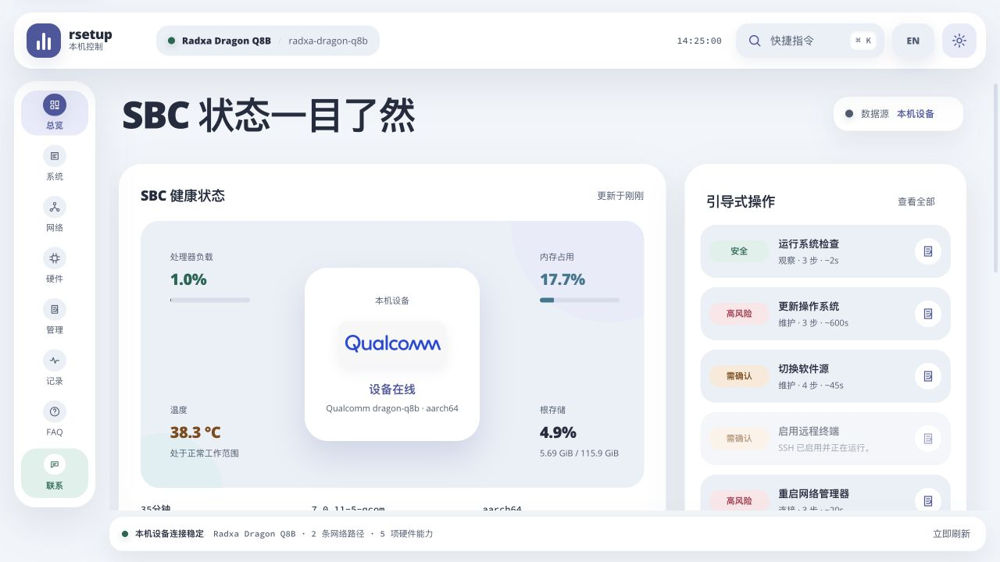

## 问题 1：EFI Overlay 被误判为 U-Boot 可修改

严重程度：High。分类：Functional。页面：`http://127.0.0.1:18789/#hardware`。

复现：在此 Q8B 运行 `rsetup-next hardware overlays status --json`，或打开硬件 → 设备树叠加层。

预期：识别 EFI 启动链。在尚无 EFI 配置适配器时明确不可修改，不能把 U-Boot 文件状态作为当前 Overlay 配置。

实际：返回 `bootloader: "u-boot"`、`supported: true`、`mutable: true`、22 项未启用 Overlay。界面显示 `u-boot · /boot/dtbo` 并提供选择和检查变更入口。实际没有提交变更，因此没有声称已复现写入失败或重启故障。

代码：`crates/rsetup-core/src/hardware.rs:1443` 的目录检测直接返回 U-Boot；`:327` 和 `:339` 仅结合 `u-boot-update` 存在与否决定可修改。应用路径调用的是 `u-boot-update`（`:466`），不是 EFI loader 配置更新。

建议：优先检测真实启动链；未适配的 EFI 系统 fail closed。将“可用 Overlay 文件”“下次启动配置”“当前运行功能”分开返回，避免误导 GPIO 映射。

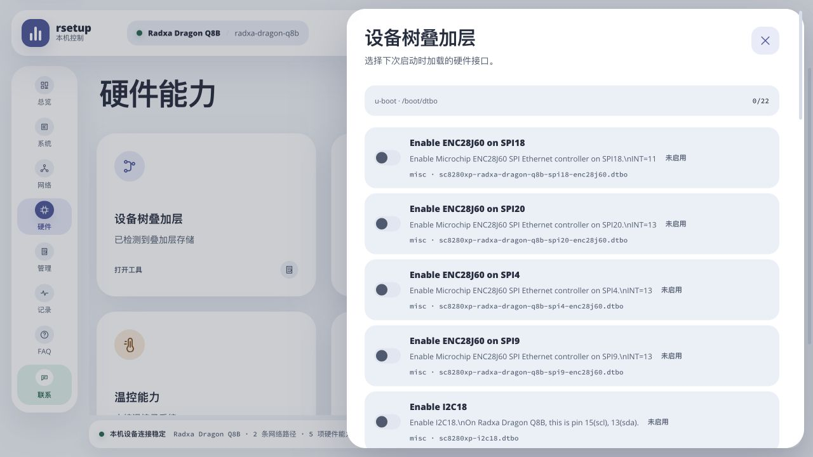

## 问题 2：编解码节点出现在摄像头列表

严重程度：Medium。分类：Functional。页面：`http://127.0.0.1:18789/#hardware`。

复现：运行 `rsetup-next hardware video status --json`，或打开硬件 → 视频采集。

预期：只将具有实际采集能力的摄像头节点列入 webcam 测试，过滤编解码/M2M、输出和元数据节点。

实际：`video0` 为 `qcom-iris-decoder`，`video1` 为 `qcom-iris-encoder`，driver 均为 `qcom-iris`；两者被列入“摄像头”下拉框，状态为 `supported: true`。当前 ffmpeg 未安装，所以按钮禁用并提示安装 ffmpeg，但安装工具不能把 codec 节点变成摄像头。

额外诊断：两个打开方式（O_RDONLY/O_RDWR，均 O_NONBLOCK）在 `video0` 上都返回 EINVAL，未能进入只读 VIDIOC_QUERYCAP；没有取得 capability 位或进行采集。节点身份依据本机 sysfs 名称和驱动，不声称 ioctl 验证成功。驱动为何拒绝打开还需后续诊断。

代码：`crates/rsetup-core/src/hardware.rs:800`–`:835` 无设备能力过滤；`crates/rsetup-core/src/probe.rs:87` 的概览能力同样只检查 `/dev/video0`。

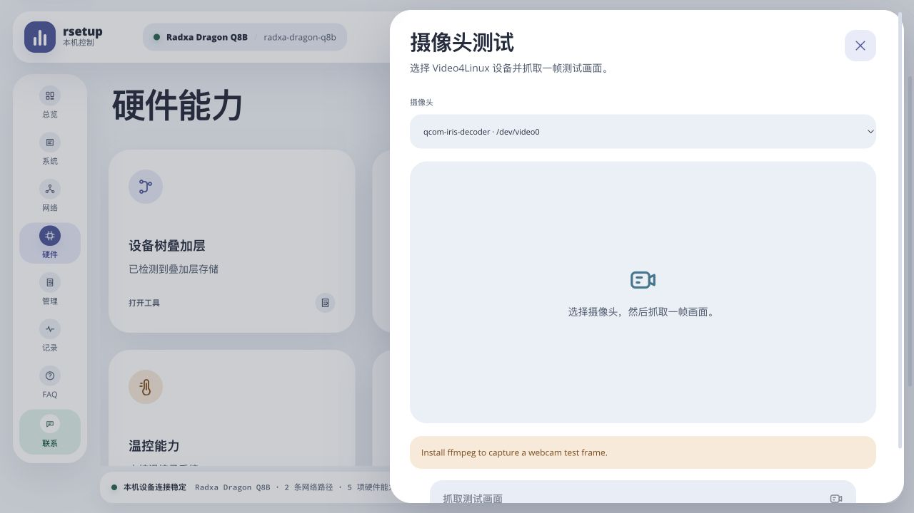

## 问题 3：SoC 名称读成 dragon-q8b

严重程度：Medium。分类：Functional。页面：`http://127.0.0.1:18789/#overview`、`#system`。

复现：比较 `/proc/device-tree/compatible` 与 `rsetup-next status --json` 的 `identity.soc`。

预期：SC8280XP；产品名仍为 Radxa Dragon Q8B。

实际：`soc: "dragon-q8b"`，Web/TUI 显示 `Qualcomm dragon-q8b`。Qualcomm 厂商识别和产品识别正确。

代码：`crates/rsetup-core/src/probe.rs:33`–`:36` 取首个 compatible 的逗号后缀，将 SBC compatible 当作 SoC compatible。

## 问题 4：根分区重复显示、可移除属性错误

严重程度：Medium。分类：Functional。页面：`http://127.0.0.1:18789/#system`。

复现：执行 `df -Pk / /boot`，查看 `status --json` 的 storage 和系统页。

预期：同一设备/挂载点只显示一次，可移除属性读取系统设备信息。

实际：`/boot` 属于根文件系统，df 返回两次 `/dev/sda3` → `/`；API 和 UI 原样显示两次相同容量。API 两项均为 `removable: true`，但 `/sys/block/sda/removable` 为 `0`。

代码：`crates/rsetup-core/src/probe.rs:261`–`:281` 没有去重，`:278` 用设备名包含 `sd`/`mmc` 推断可移除属性。

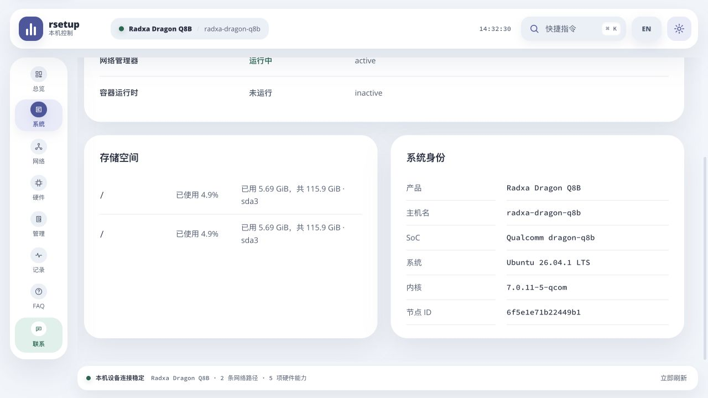

## 硬件边界与后续验证

- GPIO：gpiodetect 返回 8 个 GPIO chip，主 SoC 控制器为 `gpiochip4 [f100000.pinctrl]`、230 lines；当前 API 的 chip labels/lines 不完整，但这不影响 40Pin 官方默认表匹配。没有输出电平、上拉/下拉或外接回环测试。
- 串口：cmdline 有 `console=ttyMSM0`；debugfs 显示 serial 占用 GPIO121–124，不在当前 40Pin 表中。不能仅凭有串口 console 就断言扩展排针已被占用；也不能以 UNCLAIMED 推断全部针脚的电气状态。
- 温控：55 个温区、CPU/GPU 3 个 cooling device 可读取；未检测到可控 `pwm-fan`。曲线接口正确返回不可用。没有验证风扇硬件是否存在或实际转速。
- LED：读到 `blue:status`、`led`、`led_1`、`mmc0::` 4 个 LED class 设备，无 RGB 分组；未切换触发器或亮度，未验证实体灯光。
- SPI：未发现 NOR MTD，SPI 闪存接口正确返回不可用；没有尝试将小容量块设备作为 SPI 闪存处理。
- 摄像头：没有已确认可采集的 webcam；未抓图、未安装 ffmpeg。
- 界面附带问题：中文摄像头面板的后端缺依赖提示仍为英文；Overlay 元数据中的字面 `\n` 直接显示。列为后续文案/显示清理，不计入上方 4 项主要适配问题。
- 未验证：Overlay 写入与重启生效、SPI 烧录、LED/风扇执行、SSH/网络变更、系统更新/换源、Polkit 授权、Debian 包安装、Debian 12 运行兼容性和 Tauri 桌面壳。
- 全程没有启用 `--live-execution`，没有运行硬件变更或系统升级、重启；仅创建隔离测试文件和临时进程。sudo 只用于读取受限启动配置和内核诊断信息。
- 测试按 dogfood 规范保留了截图、复现步骤和验证边界；未修复业务代码，未提交或推送。

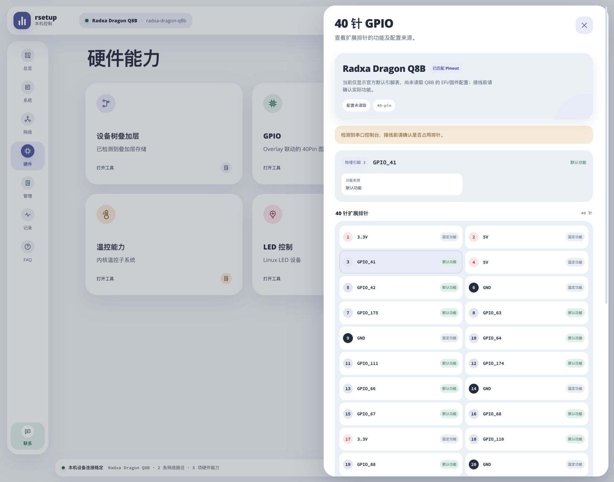

## 修复后复测

时间：2026-09-07 16:53–16:58（Asia/Shanghai）。目标机、启动内核和首轮测试目录不变；仅覆盖隔离目录中的程序源码并重新构建，没有安装系统软件包或服务。

### 修复内容与实机结果

| 项目 | 修复方式 | 实机返回 |
| --- | --- | --- |
| 启动方式 / Overlay | 优先检测 EFI 与 DT；UEFI 下不读取遗留 U-Boot 配置，不允许计划或应用 Overlay 修改 | `bootloader: "uefi-dt"`、`supported: false`、`mutable: false`、`configurationKnown: false`、`overlays: []` |
| GPIO 配置来源 | 后端显式返回配置读取状态，前端不再按产品名称推断；未知配置不生成 Overlay 功能分配 | `dragonQ8b`、40 针、`configurationKnown: false`；针脚 3 为 `GPIO_41`、16 为 `GPIO_68`，均标为默认功能 |
| 视频采集 | 查询每个节点的 V4L2 capture capability，排除 M2M、输出、元数据和查询失败节点；概览与工具使用同一探测结果 | `supported: false`、`captureAvailable: false`、`devices: []`；本机驱动仍拒绝节点打开，因此提示无法确认采集设备，不声称 QUERYCAP 在此节点成功 |
| SoC | 从 SoC compatible 识别型号，不再采用 SBC compatible 后缀 | `Qualcomm SC8280XP` |
| 根存储 | 对设备/挂载点去重，读取父磁盘 sysfs `removable`，不再按 `sd`/`mmc` 名称推断 | 仅一项 `sda3` → `/`，`removable: false` |

V4L2 节点分类依据 [Linux 内核 QUERYCAP 文档](https://docs.kernel.org/userspace-api/media/v4l/vidioc-querycap.html)，区分设备整体能力与 `device_caps` 节点能力。真实摄像头抓图仍未验证。

### 验证记录

- 本地与 Q8B（Rust 1.85.0）分别通过 82 项 Rust 测试：core 71、app 10、helper 1；新增回归覆盖 UEFI + DT / EFI 无 DT / 非 EFI、遗留 U-Boot 文件不得启用写入或影响 GPIO、视频节点能力分类、SoC compatible、分区去重及可移除属性。
- macOS `cargo clippy --workspace --all-targets --locked -- -D warnings`、`cargo fmt --all -- --check`、`git diff --check`、JS 语法检查通过；前端 i18n 测试 10 项通过。
- Q8B 原生 ARM64 静态 release 构建成功，主程序和 helper 的 `readelf -d` 均无动态段；未验证 Debian 安装包或 Debian 12 运行。
- 11 个只读 CLI 命令全部退出码 0；另有 9 项结果断言通过，涵盖上述实机值和普通用户 helper 拒绝（退出码 1）。
- 16 个 HTTP GET 检查全部 200，路径同首轮。数据接口仍返回 `synthetic: false`；未执行 POST 写入请求。
- 浏览器验证中文系统页、中文/英文硬件状态和 GPIO 默认功能；390×844 手机视口下提示可读、针脚可选择，抽屉可关闭。检查日志未见 warn/error。中英文提示区分“没有硬件”和“配置/能力尚未确认”，没有改视觉风格。
- 本轮没有重新进行 TUI 交互测试；首轮的 TUI 验证不计入本轮结果。
- 临时 Web 服务 PID 51608 已停止，测试浏览器页已关闭，手机视口已恢复；没有触碰用户原有 8788 演示服务。隔离测试目录现约 2.3 GiB，保留供后续复测。

构建可追溯信息：首轮源码归档加本轮修复归档 `fixes.tar.gz`（SHA-256 `92f942d5659f0607e3915f01993bb1dd897f21a40739ebdbed9bce615062d760`）。本轮代码仍未提交或推送。

- 主程序 SHA-256：`6af359346baf1a15b0ca78323f67bd863ecb21dd2ba4229b0cc96578d7ede34f`。
- helper SHA-256：`5ac5c05fd137e4f1f12ae02d4529353e08e946913007098733f586fe133e4517`。

### 未完成边界

UEFI + DT 的 Overlay 配置后端仍需单独适配。`configurationKnown: false` 表示没有读到有效配置，**不表示当前未启用任何 Overlay**。目前不会把官方默认表当作已验证的实际复用状态，不能据此认定排针可以安全连接外设。

本轮没有修改启动配置、LED、风扇或 GPIO 电平，没有烧录闪存、改变网络、更新系统、安装服务或重启。用户提供的登录凭据未写入仓库或测试文件。首轮列出的其余硬件和发布验证边界保持不变。

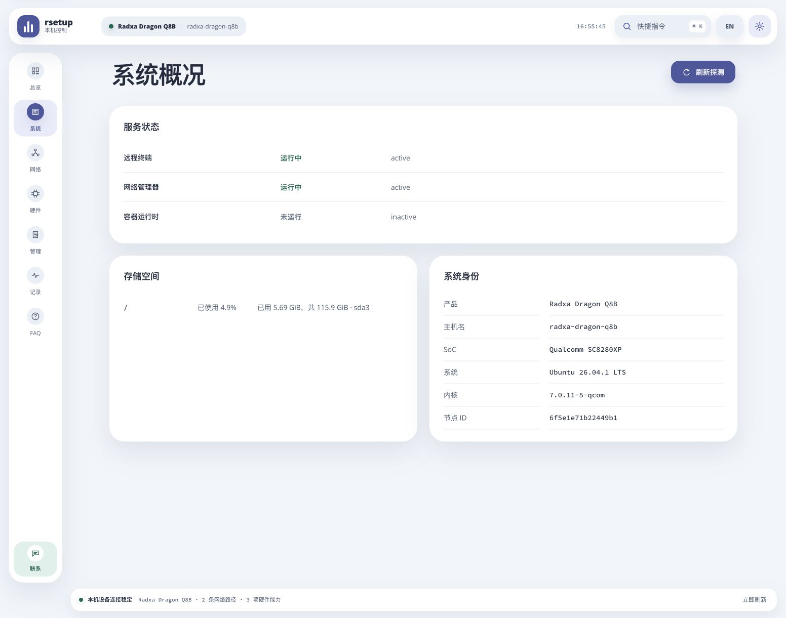

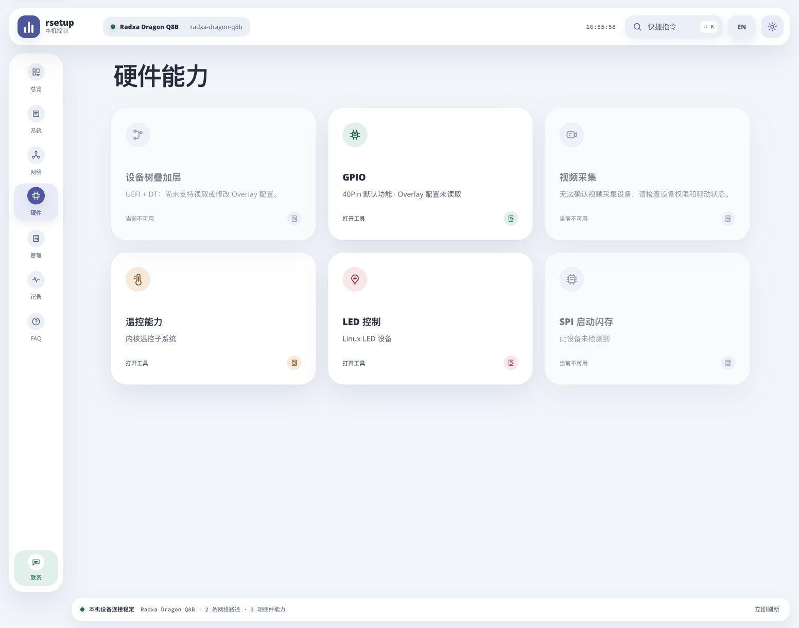

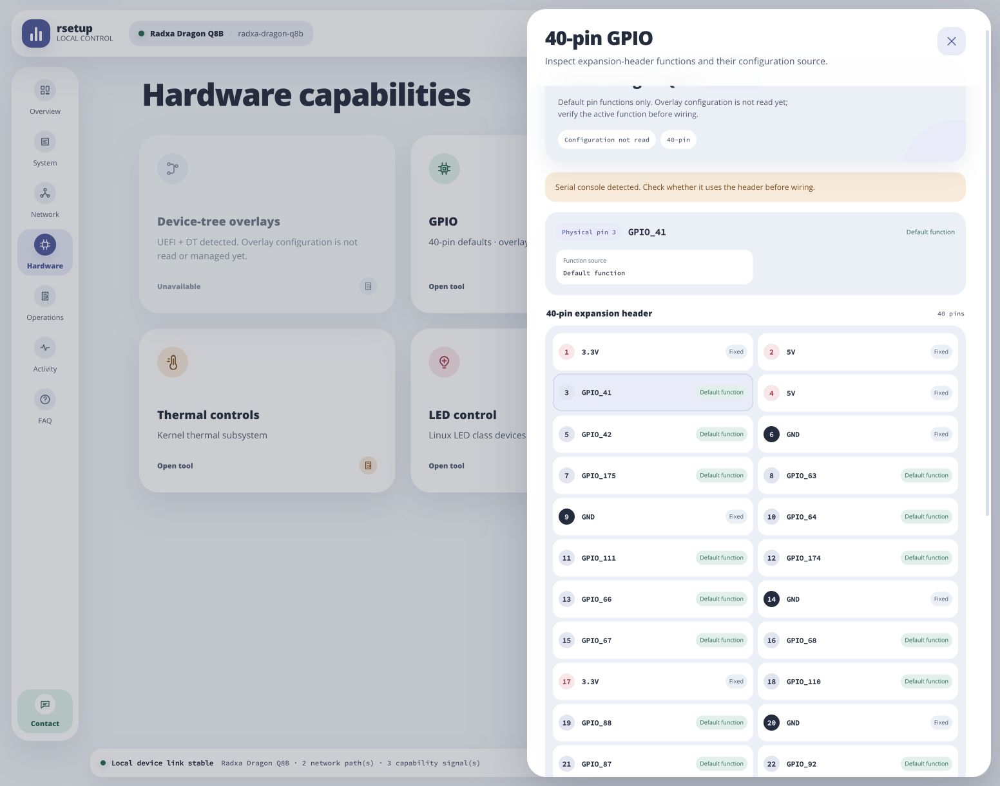

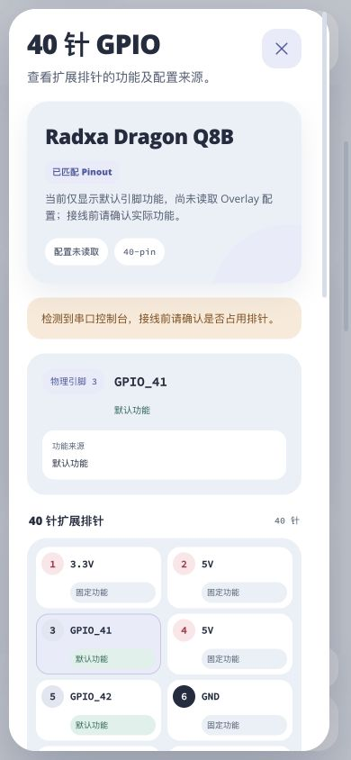

## EFI/BLS 后端迁移与只读复测（同日后续）

### 迁移范围

参考上游 [edk2-menu.sh](https://github.com/radxa-pkg/rsetup/blob/main/src/usr/lib/rsetup/cli/edk2-menu.sh)
及 [Boot Loader Specification](https://uapi-group.org/specifications/specs/boot_loader_specification/)，
在 `crates/rsetup-core/src/efi_overlay.rs` 原生实现 Q6A/Q8B 共用的 EDK2 目录布局，不调用旧 rsetup。

- 根据 `/etc/kernel/entry-token` 和运行内核定位唯一 BLS Type #1 启动项，支持 `+tries-done` 文件名；保留其他字段、initrd 顺序与其他内核启动项。
- 以 BLS 的有序 `devicetree-overlay` 引用判定已保存选择，不能只凭 `.dtbo` 后缀当作已启用。
- 预览明确列出内核、启动项、DTB 与 DTBO 前后路径；绑定配置内容，保存前校验 `fdtoverlay`，私有备份、原子替换、失败回滚。路径穿越、符号链接、大小写冲突、共享引用、歧义启动项及过期计划均拒绝。
- 增加 Web/Tauri 的“授权读取”及 CLI `overlays status/plan --authorize`、`gpio --authorize`。helper 的 `overlays-inspect` 无任意路径/命令参数，只读；不在轮询时弹授权。普通进程缓存读取结果并明确标注来源，应用时由 root 重新校验。
- GPIO 使用同一份已保存 Overlay 配置；默认功能、配置未读取、已保存配置和运行状态不混为一谈。impeccable harden 指引用于授权/缓存/失败重试状态、长路径换行和异步预览过期保护，未更换视觉风格。
- Debian 依赖增加 `device-tree-compiler`；文档、Polkit 提示、CLI 和 CI 测试入口同步更新。

### Q8B 只读结果

| 检查 | 结果 |
| --- | --- |
| 普通用户读取 | `supported: true`、`mutable: false`、`configurationKnown: false`、`requiresAuthorization: true`；工具可打开授权入口 |
| root CLI / 固定只读 helper | `uefi-dt`，读取 22 个 Overlay，`mutable: true`、`configurationKnown: true`；BLS 当前没有启用 Overlay |
| 启动项范围 | 当前内核 `7.0.11-5-qcom`；默认启动项却是 `7.0.11-6-qcom`。只预览前者，不切换默认项 |
| UART18 预览 | 一项启用变更；补充 Q8B DTB 引用及 `sc8280xp-uart18.dtbo` 引用，未应用 |
| 资源冲突 | UART18 与 SPI18 spidev 同选被拒绝，原因是共享 `spi18` 资源 |
| 真实 DTB/DTBO 合并 | 用设备已安装的 Q8B DTB 与 UART18 DTBO 执行 `fdtoverlay` 成功，输出仅位于临时测试目录 |
| 启动文件不变性 | 测试前、合并后与 Web 验证后，对 `/boot/efi/loader` 及当前内核目录内全部常规文件计算 SHA-256，路径与内容一致 |
| GPIO | `dragonQ8b`，40 针，配置来源为内核 `7.0.11-5-qcom` 的 BLS；当前保存选择为空，因此显示官方默认功能 |
| Web | 普通用户授权入口/缺 helper 错误可重试；独立 root **dry-run** 服务显示真实 EFI 列表与预览；桌面和 390×844 移动预览通过，检查的浏览器日志无 warn/error |

管理员读取和 DTB 临时合并均不属于实际 Overlay 应用。GUI 没有点击“保存叠加层选择”，没有安装 helper、Polkit 策略或服务，也没有改变 ESP 权限。

### 回归与产物

- 本地与 Q8B Rust 1.85.0：92 项默认 Rust 测试通过（core 81、app 10、helper 1）。另一个依赖 `device-tree-compiler` 的测试显式执行通过，共 93 项；它只在临时夹具内验证真实 `fdtoverlay` 调用和保存流程。
- 新增夹具覆盖 Q6A/Q8B 共用路径、精确 DTB 匹配、启动计数文件、有序选择、非默认内核隔离、GPIO 联动、过期计划、三阶段回滚和路径/锁安全。**Q6A 没有进行物理设备验证。**
- 15 项 JavaScript 测试通过，覆盖中英文、异步预览过期、失败保留选择和不可变计划提交；Clippy `-D warnings`、Rustfmt、`git diff --check` 通过。Tauri 桌面壳离线编译检查通过，未做实机桌面授权验收。
- 最终 Q8B 原生静态构建：主程序 SHA-256 `f5e4b889883fddb7addfe6dd4aca7c02a5d160974d0725ca4d5f8fe7a46144fa`；helper SHA-256 `a42a54eb496542d15a08ec70f3a3ea652334afa136fc0625c4af571b8e58bbfb`。
- 源码与构建保留在既有 `/tmp/rsetup-next-q8b-test.MhLJnm`，未安装到系统。临时测试标签页、只读 Web 进程与隧道在测试结束时关闭，原有 8788 页面未替换。

### 下一步实机验收

先安装当前版本软件包，验证普通桌面会话的 Polkit 读取/写入授权。然后由用户明确确认要使用的启动内核、具体 Overlay 和连接的外设，再执行一次计划绑定的写入与重启验证。当前默认启动内核不同，不能直接用“重启后必然生效”作为验收依据。

本轮未构建/安装 Debian 包，也未复验 Debian 12 运行环境；之前的包兼容策略不等于本轮验收结果。

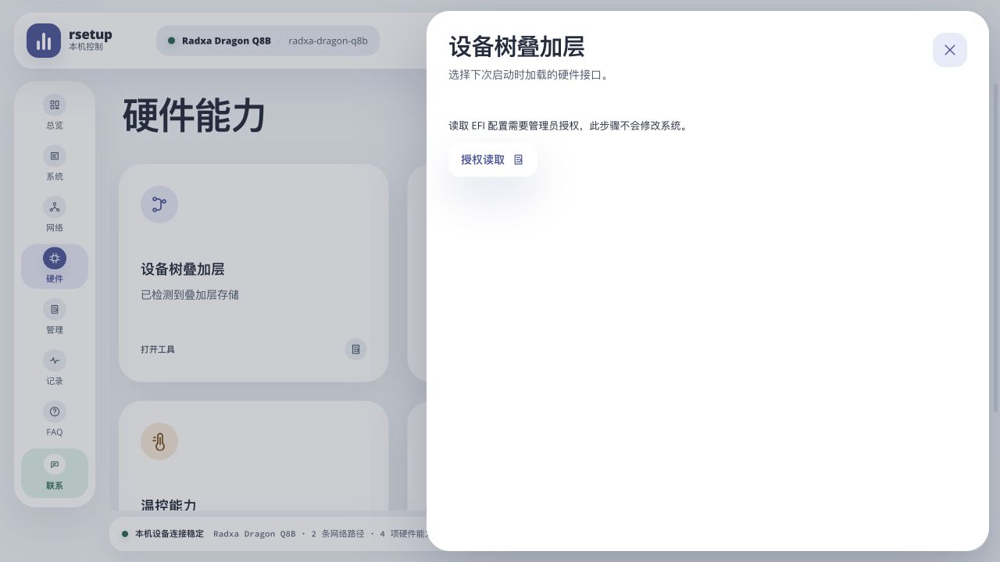

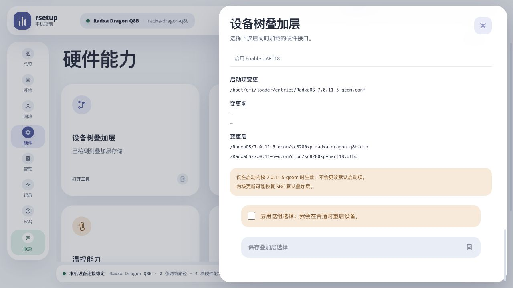

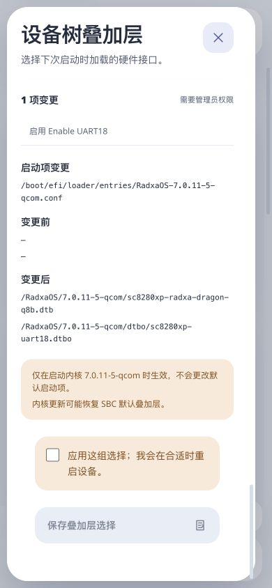
